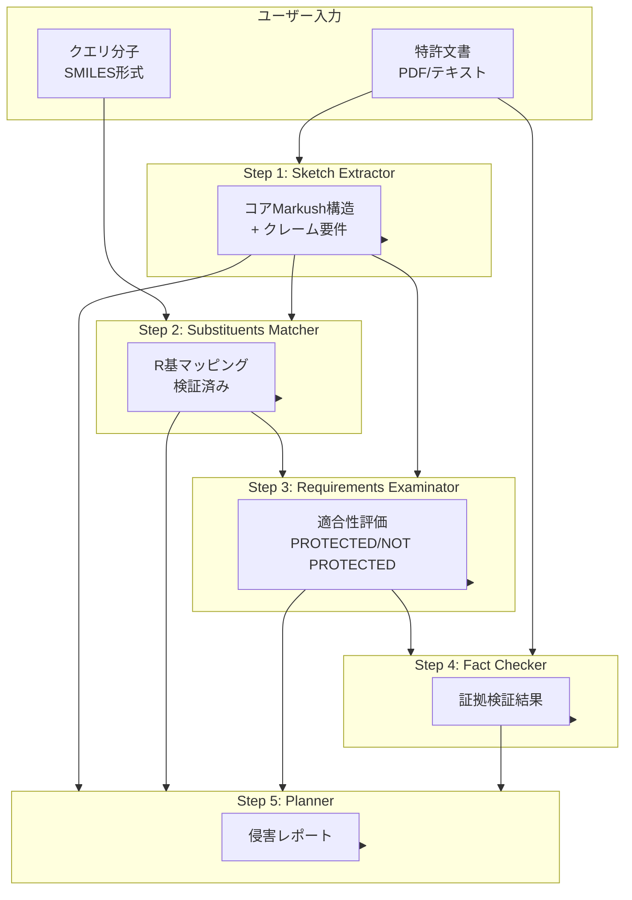
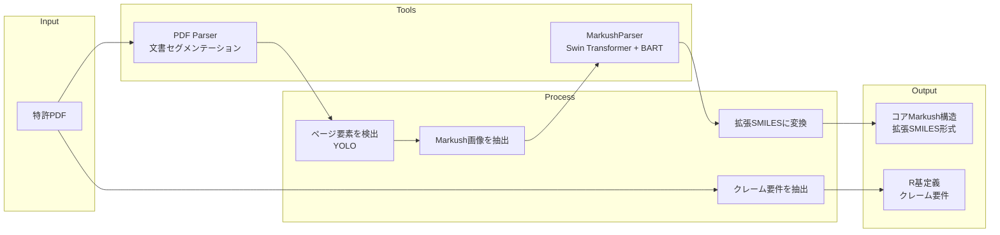
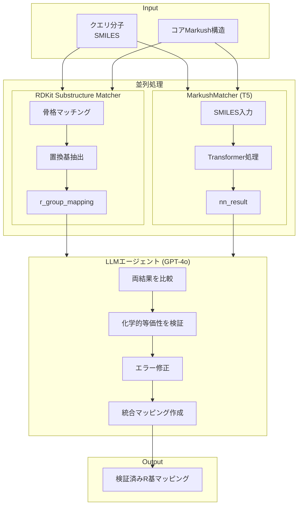
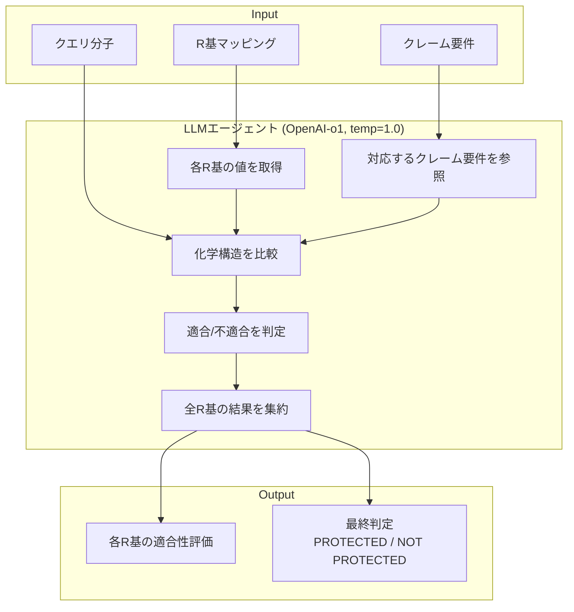
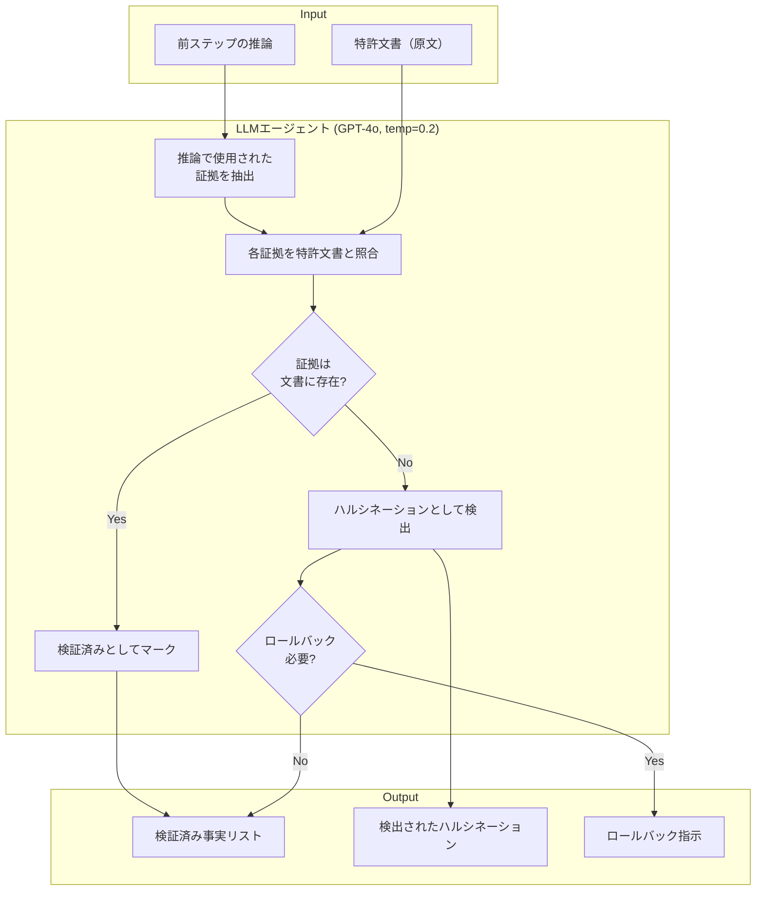
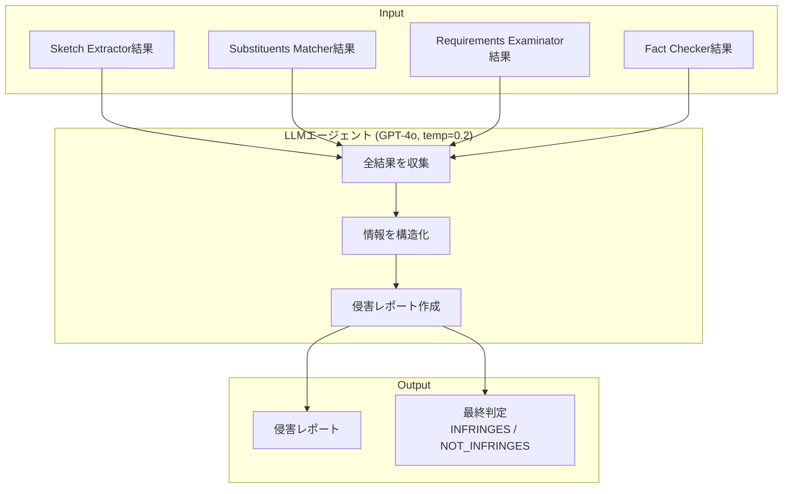
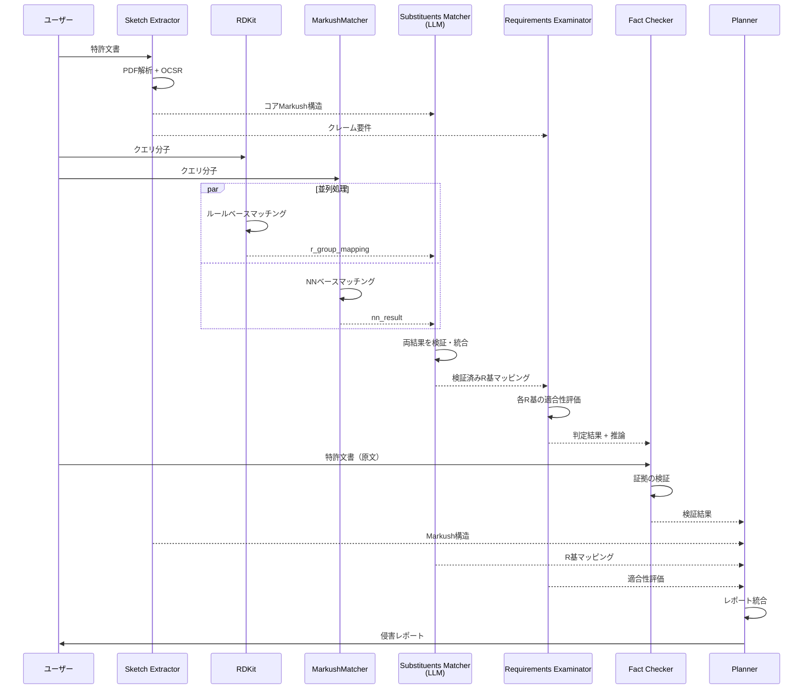

# PatentFinder - 論文再現実装

Multi-Agent System for Automated Molecular Patent Infringement Assessment

論文: [Intelligent System for Automated Molecular Patent Infringement Assessment](https://arxiv.org/abs/2412.07819) (arXiv:2412.07819v2)

## 概要

PatentFinderは、小分子の特許侵害を自動評価するマルチエージェントシステムです。5つの専門エージェントが協調して特許クレームと分子構造を分析し、解釈可能な侵害レポートを生成します。

## システム全体フロー



## 各エージェントの詳細フロー

### Step 1: Sketch Extractor



**入出力:**
| 項目 | 内容 |
|------|------|
| **入力** | 特許文書（PDF/テキスト） |
| **出力** | コアMarkush構造（拡張SMILES）、R基定義、クレーム要件 |
| **ツール** | MarkushParser（Swin Transformer + BART）、PDF Parser、YOLO |

### Step 2: Substituents Matcher



**入出力:**
| 項目 | 内容 |
|------|------|
| **入力** | クエリ分子（SMILES）、コアMarkush構造 |
| **出力** | 検証済みR基マッピング（RDKit結果 + NN結果 + 統合結果） |
| **ツール** | RDKit、MarkushMatcher（T5ベース）、GPT-4o（検証用） |

**2つのマッチング手法:**

| 手法 | 特徴 | Accuracy | Tanimoto |
|------|------|----------|----------|
| RDKit | ルールベース、単純な置換基に有効 | ≈0% | 低い |
| MarkushMatcher | T5ベースNN、高精度 | 66.8% | 92.9% |

→ **両方の結果をLLMが検証・統合**

### Step 3: Requirements Examinator



**入出力:**
| 項目 | 内容 |
|------|------|
| **入力** | R基マッピング、クレーム要件、クエリ分子 |
| **出力** | 各R基の適合性評価、最終判定 |
| **モデル** | OpenAI-o1（temperature=1.0、推論促進） |

### Step 4: Fact Checker



**入出力:**
| 項目 | 内容 |
|------|------|
| **入力** | Requirements Examinatorの出力、特許文書（原文） |
| **出力** | 証拠検証結果、ハルシネーション検出、ロールバック指示 |
| **モデル** | GPT-4o（temperature=0.2、正確性重視） |

**重要**: Fact Checkerは**侵害判定の正誤を判断しない**。**推論の根拠が特許文書に実在するか**を検証する。

### Step 5: Planner



**入出力:**
| 項目 | 内容 |
|------|------|
| **入力** | 全エージェントの出力 |
| **出力** | 包括的な侵害レポート、最終判定 |
| **モデル** | GPT-4o（temperature=0.2） |

## データフロー詳細



## 具体例

### 入力

**クエリ分子:**
```
c1ccc([C@]2(CCNCc3ccnnc3)CCOC3(CCCC3)C2)nc1
```

**特許クレーム（抜粋）:**
```
B5 is an optionally substituted thiophenyl
B3 is H or optionally substituted alkyl
D1 is an optionally substituted aryl
R21 and R22 are independently H or CH3
```

### Step 2: Substituents Matcher の出力

```json
{
  "rdkit_result": {
    "r_group_mapping": {
      "B5": "c1ccnnc1",
      "B3": "[H][H]",
      "D1": "c1ccccn1"
    }
  },
  "nn_result": {
    "r_group_mapping": {
      "B5": "CC1C=NN=CC=1",
      "B3": "[H]",
      "D1": "C1N=CC=CC=1"
    }
  },
  "r_group_mapping": {
    "B5": "c1ccnnc1",
    "B3": "[H][H]",
    "D1": "c1ccccn1"
  },
  "verification_notes": "RDKitとNNの結果を比較検証。表記の違いはあるが化学的に等価。"
}
```

### Step 3: Requirements Examinator の出力

```markdown
## R基適合性チェック

### B5 (Atom Index 0)
- **分子中の値**: c1ccnnc1 (Pyridazine ring)
- **クレーム要件**: optionally substituted thiophenyl
- **評価**: ❌ 不適合
  - Pyridazine: 6員環、2つの窒素
  - Thiophenyl: 5員環、硫黄含有
  - 構造的に異なる

### B3, D1, R21, R22
- **評価**: ✅ 適合

### 最終判定: NOT PROTECTED
```

### Step 4: Fact Checker の出力

```markdown
## 証拠の確認

### 「B5 = thiophenyl」の根拠
- Claim 1: "B5 is an optionally substituted thiophenyl"
- ✅ 特許文書に存在

### 結論
- すべての証拠が特許文書に裏付けられている
- 「NOT PROTECTED」という判定は正当
```

## セットアップ

### 1. 環境変数の設定

```bash
cp .env.template .env
# .envを編集してAWS認証情報を設定
```

### 2. Docker Composeで起動

```bash
docker compose up --build
```

### 3. ブラウザでアクセス

http://localhost:8501

## 拡張SMILES形式

```
SMILES<sep>EXTENSION
```

例:
```
*CN(*)CCC1(*)CC(*)(*)OC2(CCCC2)C1<sep><a>0:B[5]</a><a>3:B[3]</a><a>7:D[1]</a><a>10:R[21]</a><a>11:R[22]</a>
```

| タグ | 説明 | 例 |
|------|------|-----|
| `<a>` | 原子インデックスとR基名 | `<a>0:B[5]</a>` |
| `<r>` | 環インデックスとR基名 | `<r>0:R[23]</r>` |
| `<dum>` | 接続点 | `<a>0:<dum></a>` |

## 実装状況

| エージェント | 実装 | ツール |
|-------------|------|--------|
| Sketch Extractor | ダミー | MarkushParser, PDF Parser, YOLO |
| Substituents Matcher | ダミー | RDKit, MarkushMatcher, GPT-4o |
| Requirements Examinator | Strands Agent | OpenAI-o1 (temp=1.0) |
| Fact Checker | Strands Agent | GPT-4o (temp=0.2) |
| Planner | Strands Agent | GPT-4o (temp=0.2) |

## 参考文献

- 論文: [arXiv:2412.07819v2](https://arxiv.org/abs/2412.07819)
- コード: [GitHub](https://github.com/syr-cn/patentfinder_code_private)
- データセット: [MolPatent-240](https://github.com/syr-cn/patentfinder_code_private/tree/master/patent_finder/data)
