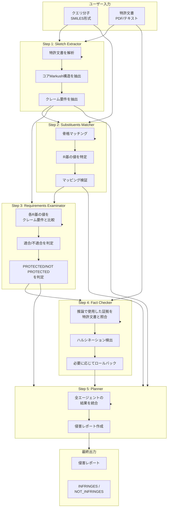
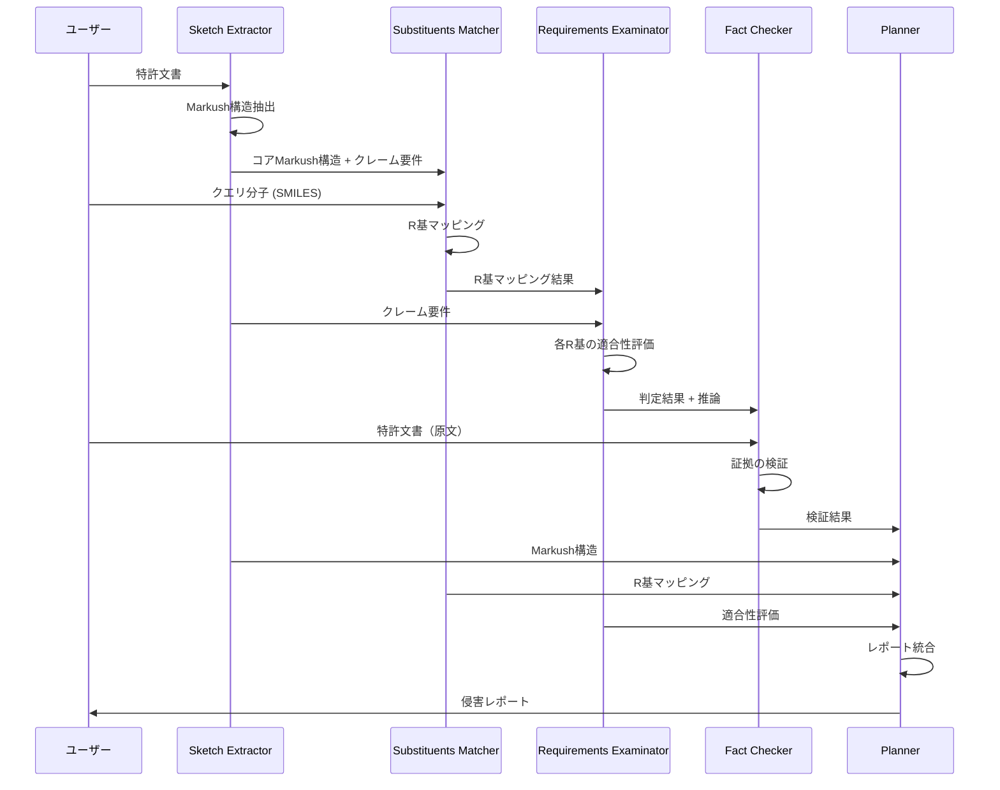

# PatentFinder - 論文再現実装

Multi-Agent System for Automated Molecular Patent Infringement Assessment

論文: [Intelligent System for Automated Molecular Patent Infringement Assessment](https://arxiv.org/abs/2412.07819) (arXiv:2412.07819v2)

## 概要

PatentFinderは、小分子の特許侵害を自動評価するマルチエージェントシステムです。5つの専門エージェントが協調して特許クレームと分子構造を分析し、解釈可能な侵害レポートを生成します。

## システムフロー



## エージェント詳細

### 1. Sketch Extractor（ダミー実装）

特許文書からコアMarkush構造とクレーム要件を抽出する。

| 項目 | 内容 |
|------|------|
| **入力** | 特許文書（PDF/テキスト） |
| **出力** | コアMarkush構造（拡張SMILES）、R基定義、クレーム要件 |
| **ツール** | MarkushParser（Swin Transformer + BART）、PDF Parser |

```
入力例:
  特許PDF または クレームテキスト

出力例:
  {
    "core_markush_smiles": "*CN(*)CCC1(*)CC(*)(*)OC2(CCCC2)C1<sep><a>0:B[5]</a><a>3:B[3]</a>...",
    "claim_requirements": {
      "B[5]": "optionally substituted thiophenyl",
      "B[3]": "H or optionally substituted alkyl",
      "D[1]": "optionally substituted aryl",
      ...
    }
  }
```

### 2. Substituents Matcher（ダミー実装）

クエリ分子の置換基グループをMarkush構造と照合し、R基の値を特定する。

| 項目 | 内容 |
|------|------|
| **入力** | クエリ分子（SMILES）、コアMarkush構造 |
| **出力** | R基マッピング（各R基の実際の値） |
| **ツール** | MarkushMatcher（T5ベース）、RDKit Substructure Matcher |

```
入力例:
  クエリ分子: c1ccc([C@]2(CCNCc3ccnnc3)CCOC3(CCCC3)C2)nc1
  Markush: *CN(*)CCC1(*)CC(*)(*)OC2(CCCC2)C1<sep>...

出力例:
  {
    "r_group_mapping": {
      "B5": "c1ccnnc1",    // Pyridazine ring
      "B3": "[H][H]",      // Hydrogen
      "D1": "c1ccccn1",    // Pyridine ring
      "R21": "[H][H]",     // Hydrogen
      "R22": "[H][H]"      // Hydrogen
    },
    "skeleton_match": true,
    "tanimoto_similarity": 0.929
  }
```

### 3. Requirements Examinator

各R基の値がクレーム要件を満たすかを評価し、保護/非保護を判定する。

| 項目 | 内容 |
|------|------|
| **入力** | R基マッピング、クレーム要件、クエリ分子 |
| **出力** | 各R基の適合性評価、最終判定（PROTECTED/NOT PROTECTED） |
| **モデル** | OpenAI-o1（temperature=1.0） |

```
入力例:
  R基マッピング: {"B5": "c1ccnnc1", ...}
  クレーム要件: {"B[5]": "optionally substituted thiophenyl", ...}

出力例:
  ## R基適合性チェック
  
  ### B5 (Atom Index 0)
  - **分子中の値**: c1ccnnc1 (Pyridazine ring)
  - **クレーム要件**: optionally substituted thiophenyl
  - **評価**: ❌ 不適合
    - Pyridazineは6員環で2つの窒素を含む
    - Thiophenylは5員環で硫黄を含む
    - 構造的に異なる
  
  ### B3, D1, R21, R22
  - **評価**: ✅ 適合
  
  ### 最終判定: NOT PROTECTED
  - 理由: B5がthiophenylではなくpyridazinyl
```

### 4. Fact Checker

前のエージェントの推論で使用された証拠が、実際に特許文書に存在するかを検証する。

| 項目 | 内容 |
|------|------|
| **入力** | Requirements Examinatorの出力、特許文書 |
| **出力** | 証拠の検証結果、ハルシネーション検出、ロールバック指示 |
| **モデル** | GPT-4o（temperature=0.2） |

**重要**: Fact Checkerは侵害判定の正誤を判断するのではなく、**推論の根拠が特許文書に実在するか**を検証する。

```
入力例:
  推論: 「B5はthiophenylでなければならないが、クエリ分子のB5はpyridazinyl」
  特許文書: Claims (36)...

出力例:
  ## 証拠の確認
  
  ### 「B5 = thiophenyl」の根拠
  - Claim 1に記載: "B5 is an optionally substituted thiophenyl"
  - ✅ 特許文書に存在
  
  ### 「クエリ分子のB5 = pyridazinyl」の根拠
  - SMILES "c1ccnnc1" から導出
  - ✅ 合理的に導出可能
  
  ## 結論
  - すべての証拠が特許文書に裏付けられている
  - 「NOT PROTECTED」という判定は正当
```

### 5. Planner

全エージェントの結果を統合し、最終的な侵害レポートを作成する。

| 項目 | 内容 |
|------|------|
| **入力** | 全エージェントの出力 |
| **出力** | 包括的な侵害レポート |
| **モデル** | GPT-4o（temperature=0.2） |

```
出力例:
  # 特許侵害評価レポート
  
  ## 1. クエリ分子の構造
  SMILES: c1ccc([C@]2(CCNCc3ccnnc3)CCOC3(CCCC3)C2)nc1
  
  ## 2. 特許Markush構造とR基定義
  コア構造: *CN(*)CCC1(*)CC(*)(*)OC2(CCCC2)C1
  - B[5]: optionally substituted thiophenyl
  - B[3]: H or optionally substituted alkyl
  - D[1]: optionally substituted aryl
  - R[21], R[22]: independently H or CH3
  
  ## 3. R基適合性分析
  | R基 | 分子中の値 | 要件 | 適合 |
  |-----|-----------|------|------|
  | B5 | pyridazinyl | thiophenyl | ❌ |
  | B3 | H | H or alkyl | ✅ |
  | D1 | pyridyl | aryl | ✅ |
  | R21 | H | H or CH3 | ✅ |
  | R22 | H | H or CH3 | ✅ |
  
  ## 4. 最終判定
  **NOT_INFRINGES**
  
  ## 5. 判定理由
  B5置換基がクレーム要件を満たさない。
  クレームではthiophenyl（硫黄含有5員環）が要求されているが、
  クエリ分子はpyridazinyl（窒素含有6員環）を持つ。
```

## データフロー図



## セットアップ

### 1. 環境変数の設定

```bash
cp .env.template .env
# .envを編集してAWS認証情報を設定
```

### 2. Docker Composeで起動

```bash
docker compose up --build
```

### 3. ブラウザでアクセス

http://localhost:8501

## 拡張SMILES形式

PatentFinderでは、Markush構造を表現するために拡張SMILES形式を使用します。

```
SMILES<sep>EXTENSION
```

例:
```
*CN(*)CCC1(*)CC(*)(*)OC2(CCCC2)C1<sep><a>0:B[5]</a><a>3:B[3]</a><a>7:D[1]</a><a>10:R[21]</a><a>11:R[22]</a>
```

| タグ | 説明 | 例 |
|------|------|-----|
| `<a>` | 原子インデックスとR基名のマッピング | `<a>0:B[5]</a>` |
| `<r>` | 環インデックスとR基名のマッピング | `<r>0:R[23]</r>` |
| `<dum>` | 接続点を示す特殊トークン | `<a>0:<dum></a>` |

## 技術スタック

- Python 3.11
- Strands Agents (AWS Bedrock)
- Streamlit
- Docker

## 実装状況

| エージェント | 実装 | 備考 |
|-------------|------|------|
| Sketch Extractor | ダミー | MarkushParser別途検証済み |
| Substituents Matcher | ダミー | MarkushMatcher別途検証済み |
| Requirements Examinator | Strands Agent | LLMで実装 |
| Fact Checker | Strands Agent | LLMで実装 |
| Planner | Strands Agent | LLMで実装 |

## 注意事項

- 実際の特許侵害判定には専門家の確認が必要です
- 本実装は論文の再現を目的としています

## 参考文献

- 論文: [arXiv:2412.07819v2](https://arxiv.org/abs/2412.07819)
- コード: [GitHub](https://github.com/syr-cn/patentfinder_code_private)
- データセット: [MolPatent-240](https://github.com/syr-cn/patentfinder_code_private/tree/master/patent_finder/data)
